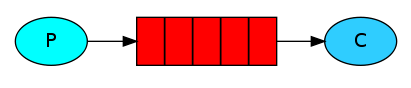

# simple示例

> 不考虑交换机，只有一个生产者P、一个队列和一个消费者C的情况示例



## 使用方法

进入文件夹

```shell
cd simple
```

发送一条消息

```shell
go run send.go
```

启动消费者 监听队列中的消息

```shell
go run receive.go
```

可以多次发送消息，消费者进程没有终止的情况下会持续监听队列并及时响应

## 队列

相当于一个缓存区，用于存放生产者发布的消息

- name 队列名称
- durable 持久化队列会在服务器重启后恢复
- autoDelete 队列中没有消费者时会自动删除队列
- exclusive 私有队列
- noWait 等待服务器响应

## 生产者

生产者就是发布消息的程序

- context 用于在超时等情况下取消发布
- exchange 交换机 简单使用可以不用交换机
- key 路由key 决定消息分配到哪个队列中
- mandatory 如果路由key没有对应的队列会报错
- immediate 如果没有消费者立刻消费会报错
- msg 发布的信息

## 消费者

消费者就是处理消息的程序

- consumer 消费者的名字
- autoAck 自动确认 如果为false 需要通过Delivery.Ack方法手动确认收到消息
- exclusive 如果设置为true 第二个消费者在注册使用相同队列时会引发panic
- noLocal 这个配置项目前RabbitMQ不支持
- noWait 不等待服务器确认就直接开始接收消息 可能会出错